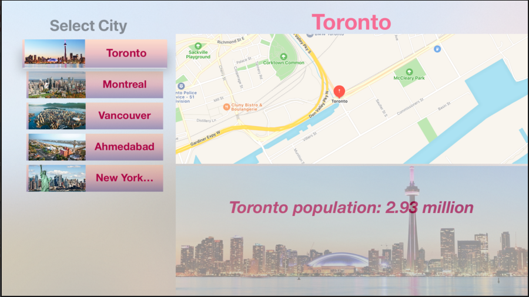

# Swift-JSON-TV

### Technologies Used
* MySQL Database 
* Php Script to convert MySQL Data into JSON
* NSObject fetch the data using into Dictionary
* Implemented Collection View as well as Split View for TV OS
* Map Kit gets Lat and Long from the JSON-API and display the location of that with some animation 

### Sample Images

